# cardputer-zero-default-apps

`cardputer-zero-default-apps` contains the default small-screen Linux
applications for Cardputer Zero Shell.

These programs are ordinary GUI applications. They run inside the already
authenticated Linux user session, create normal compositor-managed windows, and
turn existing Linux capabilities into 320x170 handheld interfaces.

The project goal is intentionally narrow: make system tasks usable on the
Cardputer Zero screen without inventing a new system layer.

## Scope

This repository owns the default application UI and thin backend adapters for:

- Files
- Settings
- System Monitor
- Power
- Terminal

It does not own:

- login
- PAM
- user creation
- session startup
- seat management
- polkit agents
- window management
- global shortcut policy
- system permission policy

Those responsibilities belong to `cardputer-zero-os`, `cardputer-zero-shell`,
or the standard Linux stack.

## Architecture

```text
cardputer-zero-os
  -> login, session, labwc, polkit, system services

cardputer-zero-shell
  -> launcher, task switcher, APPLaunch scanning

cardputer-zero-default-apps
  -> normal GTK applications
  -> small-screen UI
  -> Linux command, D-Bus, procfs, sysfs, and file adapters
```

The default apps call existing tools such as:

```text
systemd / loginctl / NetworkManager / PipeWire / procfs / sysfs / gio
```

When an operation needs authorization, the app calls the normal system command
and lets Linux, systemd, logind, or polkit handle the policy. This repository
does not add `sudo` wrappers, password storage, or a separate permission model.

## Visual Language

The apps use the same small-screen design language as Cardputer Zero OS and
Shell:

- retro paper UI
- clean monochrome handheld UI
- 1px black outlines
- warm paper backgrounds
- hard 1px or 2px shadows
- orange selected state
- keyboard-first interaction
- fixed 320x170 windows

Theme tokens:

| Token | Hex | Role |
| --- | --- | --- |
| Zero Paper | `#E9E4D5` | screen background |
| Panel Cream | `#F4F0E6` | panels and controls |
| Icon Well | `#F8F4EA` | keycaps, icon wells, light fills |
| Ink Black | `#171717` | text and icons |
| Line Black | `#2A2A2A` | outlines and separators |
| Muted Text | `#6E6A61` | secondary values |
| Accent Orange | `#E66A2C` | focus and active state |
| OK Green | `#3A7D44` | healthy state |
| Warn Red | `#B94A2C` | warnings and dangerous actions |
| Hard Shadow | `#BDB5A4` | hard shadow |

## Files

`zero-files` is the small-screen file manager. It provides a compact file list,
keyboard/action hints, path/status information, menu actions, and an inline
properties view.

It uses the normal Linux filesystem as its source of truth. File operations are
thin adapters over Python file APIs and system tools such as `gio open` and
`gio trash`.

### File List

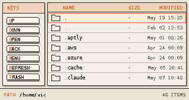

### Menu

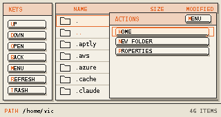

### Properties

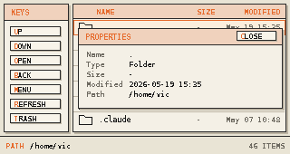

## Settings

`zero-settings` is the small-screen settings application. It is a normal Linux
GUI program, not a system policy service.

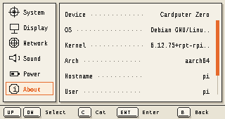

The UI is split into a category area and a detail area. Current categories are:

- System
- Display
- Network
- Sound
- Power
- About

Settings reads system facts through existing Linux commands and files. Examples
include `hostnamectl`, `localectl`, `timedatectl`, `nmcli`, `wpctl`, `pactl`,
`brightnessctl`, `/etc/os-release`, and `/sys`.

User preferences owned by the default apps are stored under:

```text
~/.config/cardputer-zero/default-apps/
```

Shell preferences that need to be shared with Cardputer Zero Shell can be stored
under:

```text
~/.config/cardputer-zero/shell/
```

The app does not implement login, session, polkit, or permission rules. If a
setting requires authorization, the backend calls the standard command and the
system handles the result.

## System Monitor

`zero-system-monitor` shows current system information in small, single-topic
tabs:

- CPU
- RAM
- Disk
- Network
- Temperature

The monitor reads live Linux data from `/proc`, `/sys`, `ps`, `df`, `ip`, and
thermal interfaces. The CPU and RAM pages emphasize the top four processes so
the view stays useful on a 320x170 screen. Network shows Wi-Fi and Ethernet
addresses when those interfaces exist.

### CPU

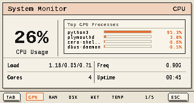

### RAM

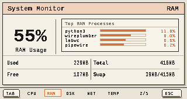

### Disk

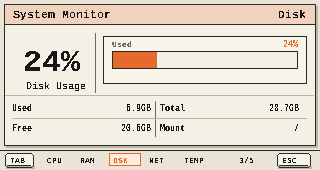

### Network

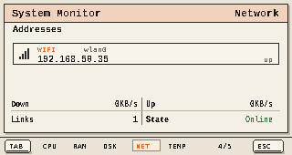

### Temperature

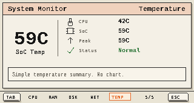

## Power

`zero-power-menu` is a standalone quick action panel for power operations. It is
not the Settings power page and does not manage power policy.

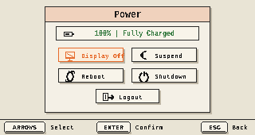

Actions:

- Display Off
- Suspend
- Reboot
- Shutdown
- Logout

Dangerous actions use an in-app confirmation page. The backend calls normal
Linux commands:

```text
systemctl suspend
systemctl reboot
systemctl poweroff
loginctl terminate-session
```

Display-off support uses available compositor/system tools when present, such
as `wlopm` or `xset`. Logout targets the active Cardputer Zero session rather
than killing arbitrary shell processes.

## Terminal

`zero-terminal` is the default terminal entry for Cardputer Zero. It is a
small-screen terminal front end with tab management and terminal rendering. The
target behavior is a frameless 320x170 terminal app, not a large desktop
terminal window.

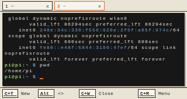

## Desktop Entries

The installer writes APPLaunch entries to:

```text
/usr/share/APPLaunch/applications/
```

Current entries:

```text
10-zero-settings.desktop
20-zero-terminal.desktop
30-zero-files.desktop
40-zero-system-monitor.desktop
90-zero-power-menu.desktop
100-zero-app-store.desktop
```

Each desktop entry declares Cardputer Zero metadata such as:

```ini
X-Zero-AppId=...
X-Zero-Display=wayland
```

## Install

Required packages:

```sh
sudo apt-get install python3 python3-gi gir1.2-gtk-4.0
```

Recommended packages:

```sh
sudo apt-get install foot brightnessctl network-manager pipewire-pulse \
  libglib2.0-bin trash-cli packagekit
```

Install from the source tree:

```sh
sudo ./install.sh
```

Installed paths:

```text
/usr/bin/zero-settings
/usr/bin/zero-terminal
/usr/bin/zero-files
/usr/bin/zero-power-menu
/usr/bin/zero-system-monitor
/usr/bin/zero-app-store
/usr/lib/python3/dist-packages/czero_apps/
/usr/share/APPLaunch/applications/*.desktop
/usr/share/APPLaunch/icons/*.svg
```

## Development

Run from the source tree:

```sh
PYTHONPATH=src python3 -m czero_apps.main settings
PYTHONPATH=src python3 -m czero_apps.main monitor
PYTHONPATH=src python3 -m czero_apps.main files
PYTHONPATH=src python3 -m czero_apps.main terminal
PYTHONPATH=src python3 -m czero_apps.main power
```

Syntax check:

```sh
python3 -m compileall src
```
